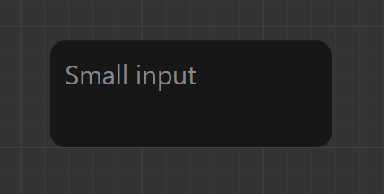

---
layout:
  title:
    visible: true
  description:
    visible: false
  tableOfContents:
    visible: true
  outline:
    visible: true
  pagination:
    visible: true
---

# Alert

### Properties

* duration: number
* title: string
* description?: string
* icon?: ReactNode
* closeButton: boolean




<figure><figcaption></figcaption></figure>



```tsx
const alertRef = useRef<AlertRef>(null);

<Alert duration={3000}
       closeButton={true}
       ref={alertRef}
       icon={<Rocket size={30} className={"text-white"}/>}
       title={"This is a cool alert"}
       description={"This is the alert description!"}
/>

<button onClick={alertRef.current?.show()}/>
```


